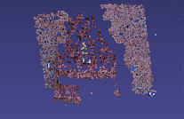

# (Ongoing) How to Structure from Motion 

A self reliant tutorial on _Structure from Motion_ (SFM). 



In this repository, we provide
* Self-reliant tutorial on SFM
* SFM Pipeline Code
* Associated Booklet

## 1. Getting Started

These instructions will get you a copy of the project up and running on your local machine for development and testing purposes.

### 1.1. Prerequisites

To run tutorials, you need to have following libraries installed:
```
Numpy >= 1.13.1
OpenCV 3
Meshlab
```
Furthermore, to run SFM python script, you also need: 
```
OpenCV Contrib
```

### 1.2. Data 
Please download the standard data benchmarks from [here](https://github.com/openMVG/SfM_quality_evaluation)

After downloading, you should have the following directory structure 
```
data/
    fountain-P11/ 
        images/
            0001.jpg
            ...
            0011.jpg
        gt_dense_cameras/
            0000.jpg.camera
            ...
            0011.jpg.camera
    Herz-Jesus-P8/
        ...
    Castle-P19/
        ...
    ...
```

## 2. Demo/Quick Start

### 2.1. Tutorial Notebook 
1. Chapter 1: Prerequisites
2. Chapter 2: Epipolar Geometry
3. Chapter 3: 3D Scene Estimations
4. Chapter 4: Putting It Together: Part I
5. Chapter 5: Bundle Adjustment
6. Chapter 6: Putting It Together: Part II

### 2.2. SFM Pipeline
1. Go to `script/` directory
    ```
    cd script
    ```

2. Run `featmatch.py` to generate feature keypoints, descriptors and matches
    ```
    python featmatch.py
    ```

    All arguments are shown below: 
    ```
    usage: featmatch.py [-h] [--data_dir DATA_DIR] [--ext EXT] [--out_dir OUT_DIR]
                        [--features FEATURES] [--print_every PRINT_EVERY]
                        [--save_results SAVE_RESULTS]
    ```

3. Run `sfm.py` to generate point cloud: 
    ```
    python sfm.py --data-dir <path-to-data-directory>
    ```

    All arguments are shown below
    ```
    usage: sfm.py [-h] [--data_dir DATA_DIR] [--dataset DATASET] [--ext EXT]
              [--out_dir OUT_DIR] [--features FEATURES] [--matcher MATCHER]
              [--cross_check CROSS_CHECK] [--calibration_mat CALIBRATION_MAT]
              [--fund_method FUND_METHOD] [--outlier_thres OUTLIER_THRES]
              [--fund_prob FUND_PROB] [--pnp_method PNP_METHOD]
              [--pnp_prob PNP_PROB] [--allow_duplicates ALLOW_DUPLICATES]
              [--color_policy COLOR_POLICY] [--plot_error PLOT_ERROR]
              [--verbose VERBOSE]

    optional arguments:
    -h, --help            show this help message and exit
    --data_dir DATA_DIR
    --dataset DATASET
    --ext EXT
    --out_dir OUT_DIR
    --features FEATURES
    --matcher MATCHER
    --cross_check CROSS_CHECK
    --calibration_mat CALIBRATION_MAT
    --fund_method FUND_METHOD
    --outlier_thres OUTLIER_THRES
    --fund_prob FUND_PROB
    --pnp_method PNP_METHOD
    --pnp_prob PNP_PROB
    --allow_duplicates ALLOW_DUPLICATES
    --color_policy COLOR_POLICY
    --plot_error PLOT_ERROR
    --verbose VERBOSE
    ```

### 2.3. Booklet
You can download the initial draft of the booklet from [here](https://github.com/muneebaadil)

## 3. Results
### 3.1. Fountain P11
### 3.2. Castle P19
### 3.3. Herz Jesus P8

## Authors

* [Muneeb Aadil](https://github.com/muneebaadil) (imuneebaadil@gmail.com)
* [Sibt Ul Hussain](https://sites.google.com/site/sibtulhussain/) (sibtul.hussain@nu.edu.pk)