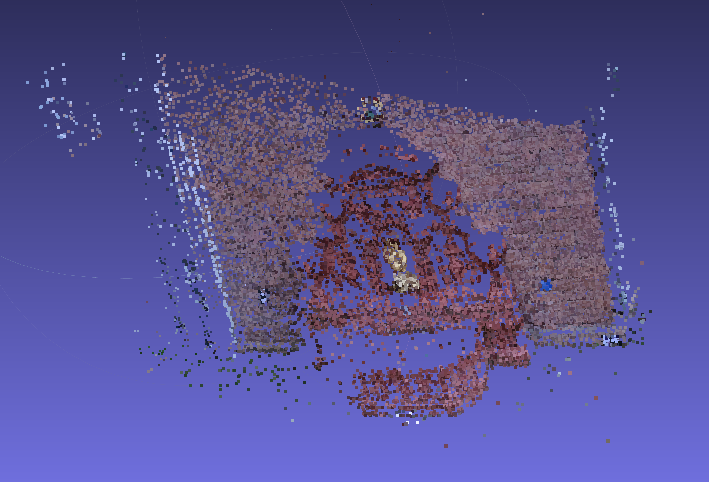
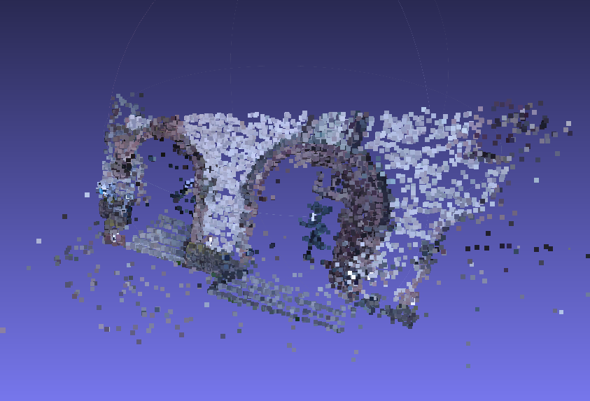
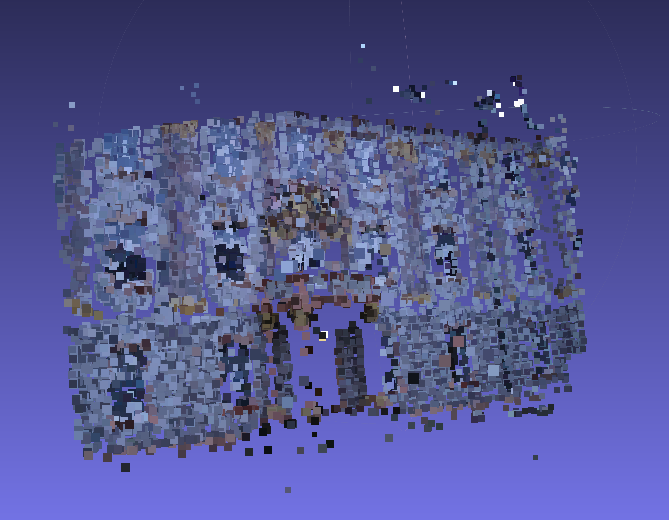

# Structure from Motion 

Structure from Motion (SFM) from scratch, using Numpy and OpenCV. 



In this repository, we provide
* Self-reliant tutorial on SFM
* SFM Python Script
* Associated Booklet

## 1. Getting Started

These instructions will get you a copy of the project up and running on your local machine for development and testing purposes.

### 1.1. Prerequisites

To run tutorials, you need to have following libraries installed:
```
Numpy >= 1.13.1
OpenCV 3
Meshlab
```
Furthermore, to run SFM python script, you also need: 
```
OpenCV Contrib
```

### 1.2. Data 
Please download the standard data benchmarks from [here](https://github.com/openMVG/SfM_quality_evaluation)

After downloading, you should have the following directory structure 
```
data/
    fountain-P11/ 
        images/
            0001.jpg
            ...
            0011.jpg
        gt_dense_cameras/
            0000.jpg.camera
            ...
            0011.jpg.camera
    Herz-Jesus-P8/
        ...
    Castle-P19/
        ...
    ...
```

## 2. Demo/Quick Start

### 2.1. Tutorial Notebook 
Tutorials are in `tutorial/` directory. Furthermore, they're divided in following sections
1. Chapter 1: Prerequisites
2. Chapter 2: Epipolar Geometry
3. Chapter 3: 3D Scene Estimations
4. Chapter 4: Putting It Together: Part I

### 2.2. SFM Script
1. Go to `script/` directory
    ```
    cd script
    ```

2. Run `featmatch.py` to generate feature keypoints, descriptors and matches
    ```
    python featmatch.py
    ```

    All arguments are shown below: 
    ```
    usage: featmatch.py [-h] [--data_dir DATA_DIR] [--ext EXT] [--out_dir OUT_DIR]
                        [--features FEATURES] [--print_every PRINT_EVERY]
                        [--save_results SAVE_RESULTS]

    optional arguments:
    -h, --help            show this help message and exit

    --data_dir  directory containing images (default: ../data/fountain-P11/images/)
    --ext   comma seperated string of allowed image extensions (default: jpg,png)
    --out_dir   root directory to store results in (default: ../data/fountain-P11)

    --features  [SIFT|SURF] Feature algorithm to use (default: SURF)
    --matcher   [BFMatcher|FlannBasedMatcher] Matching algorithm to use (default: BFMatcher)
    --cross_check   [True|False] Whether to cross check feature matching or not (default: True)

    --print_every   [1,+inf] print progress every print_every seconds, -1 to disable (default: 1)
    --save_results  [True|False] whether to save images with keypoints drawn on them (default: False)
    ```

3. Run `sfm.py` to generate point cloud: 
    ```
    python sfm.py --data-dir <path-to-data-directory>
    ```

    All arguments are shown below
    ```
    usage: sfm.py [-h] [--data_dir DATA_DIR] [--dataset DATASET] [--ext EXT]
              [--out_dir OUT_DIR] [--features FEATURES] [--matcher MATCHER]
              [--cross_check CROSS_CHECK] [--calibration_mat CALIBRATION_MAT]
              [--fund_method FUND_METHOD] [--outlier_thres OUTLIER_THRES]
              [--fund_prob FUND_PROB] [--pnp_method PNP_METHOD]
              [--pnp_prob PNP_PROB] [--allow_duplicates ALLOW_DUPLICATES]
              [--color_policy COLOR_POLICY] [--plot_error PLOT_ERROR]
              [--verbose VERBOSE]

    optional arguments:
    -h, --help            show this help message and exit
    
    --data_dir  root directory containing input data (default: ../data/)
    --dataset   name of dataset (default: fountain-P11)
    --ext   comma seperated string of allowed image extensions (default: jpg,png)
    --out_dir   root directory to store results in (default: ../results/)

    --features  [SIFT|SURF] Feature algorithm to use (default: SURF)
    --matcher   [BFMatcher|FlannBasedMatcher] Matching algorithm to use (default: BFMatcher)
    --calibration_mat   [benchmark|lg_g3] Type of intrinsic camera to use (default: benchmark)
    
    --fund_method   [FM_RANSAC | FM_8POINT] Method to estimate fundamental matrix (default: FM_RANSAC)
    --outlier_thres     Threshold value of outlier to be used in fundamental matrix estimation (default: 0.9)
    --fund_prob     [0, 1] Confidence in fundamental matrix estimation required(default: 0.9)

    --pnp_method    [SOLVEPNP_DLS | SOLVEPNP_EPNP | ...] Method used for PnP estimation (default: SOLVEPNP_DLS)
    --pnp_prob  [0, 1] Confidence in PnP estimation required (default: 0.99)
    ```

## 3. Results
### 3.1. Fountain P11


### 3.2. Herz Jesus P8


### 3.3. Entry P10


## Authors
* [Muneeb Aadil](https://muneebaadil.github.io)
* [Sibt ul Hussain](https://sites.google.com/site/sibtulhussain/)
